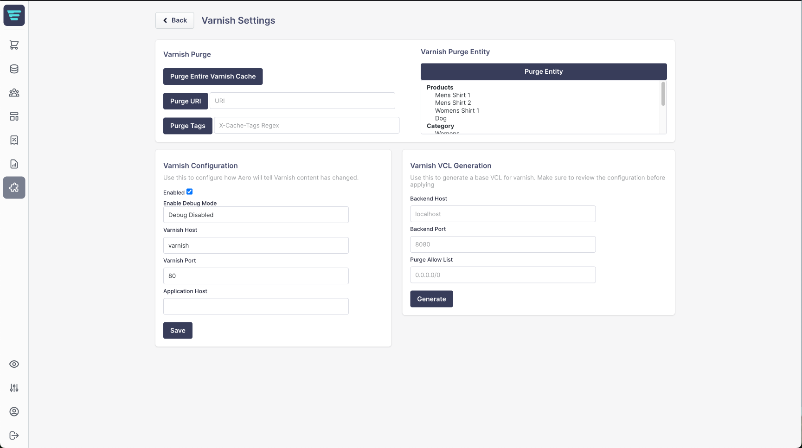

# Aerocommerce Varnish Integration

Experimental module to implement Varnish into Aero Commerce.

Performance & throughput improvements will depend on your cache hit rates. 

From an extremely rudimentary k6 load test on the demo store below (Hetzner CPX31, 4c 8GB), assuming fairly high cache hit rate. We see a bump from 21 reqs/s to 3.3k reqs/s and a p95 response time drop from 6s to 51ms.




## Installation Steps

```sh
composer config repositories.samjuk-aero-module-varnish vcs git@github.com:SamJUK/aero-module-varnish.git
composer require samjuk/aero-module-varnish:@dev
```

## Demo Store

A very basic demo store running the Varnish module, that is used for load testing.

URL | Server Specs | Notes
--- | --- | ---
https://aero.sdj.pw | Hetzner CPX31 (Quad Core, 8GB Ram) | Running via Docker Compose behind a Traefik Proxy.